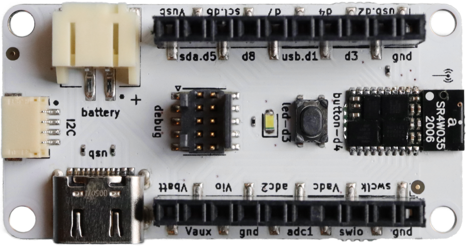
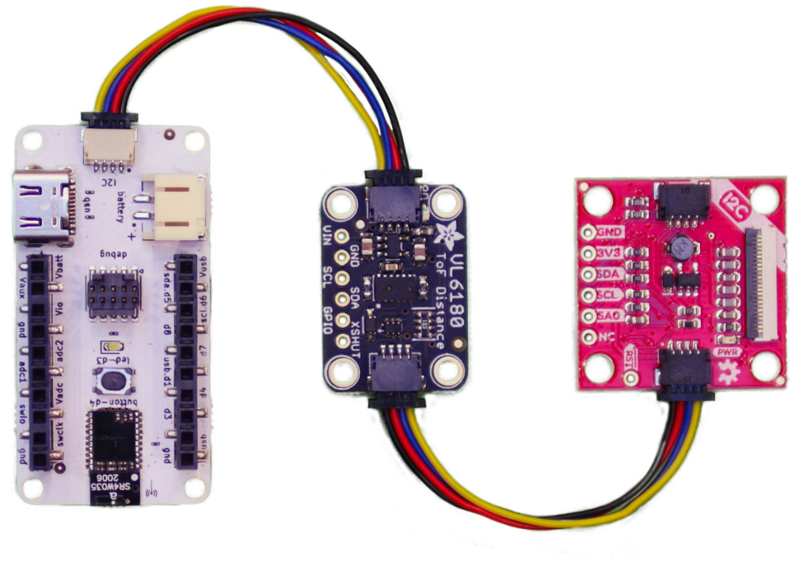

# S1 Popout Board by Silicon Witchery

A handy breakout board for the [S1 Module](https://www.siliconwitchery.com/module).

**Check out the [S1 SDK](https://github.com/siliconwitchery/s1-sdk) for firmware templates and examples compatible with the S1 Popout.**

**Features:**

- Pre-soldered S1 Module.
- USB-C charging & data.
- JST battery header.
- [QUIIC](https://www.sparkfun.com/qwiic) / [STEMMA QT](https://learn.adafruit.com/introducing-adafruit-stemma-qt) compatible I2C port.
- Serial Wire Debug port.
- All GPIO broken out.

Order the S1 Popout Board from [Digi-Key](https://www.digikey.com/en/products/detail/silicon-witchery/S1-POPOUT-BOARD/15926536) 🛍

 

 

## All in one module
The S1 Popout lets you quickly get started with all kinds of IoT projects. It features our **S1 Module** with:

- **Bluetooth 5.2** based on the Nordic nRF52811.
- **iCE40 FPGA** with 5k LUT & DSP.
- **Battery management** with charging and 3 adjustable voltage rails.
- **32Mb SPI Flash** for storing your FPGA binary and other user data.

## Plug & Play Sensors

I2C sensor modules that can be daisy chained using the built in QUIIC / StemmaQT connector. [Sparkfun](https://www.sparkfun.com/qwiic) and [Adafruit](https://learn.adafruit.com/introducing-adafruit-stemma-qt) have tons of modules for popular sensors such as:

- LSM9DS1 9 Axis Accelerometer/Gyro/Magnetometer
- AS7341 10 channel visible & IR light sensor
- PA1010D GPS module
- APDS9960 Proximity Sensor
- ST25DV16K re-programmable NFC tag

 

 

## Battery & USB

You can use any single lithium polymer cell to power the Popout Board, or power it simply from a 5V USB Type C plug.

Connecting the USB cable will also charge any connected battery. By default, the charge rate is low enough that even small cells can safely be charged, however for larger cells, the charge rate should be configured within firmware.

In time we'll also be supporting USB data so you'll be able to talk to the FPGA over USB.

## Licence

Copyright 2022 © Silicon Witchery.

This design is licenced under: [CERN Open Hardware Licence Version 2 - Permissive](https://ohwr.org/cern_ohl_p_v2.pdf).